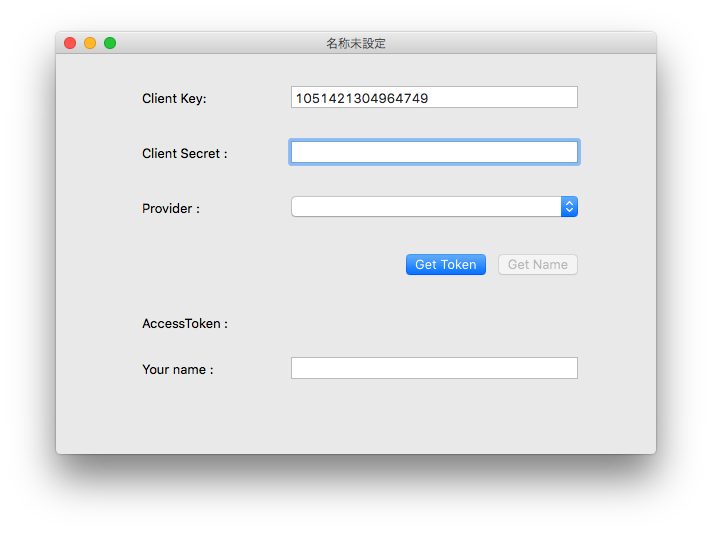
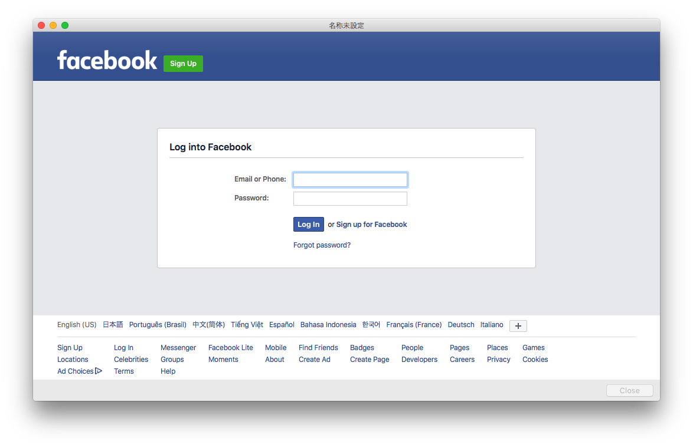
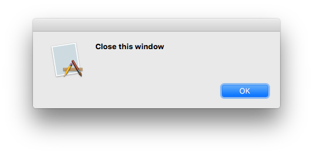
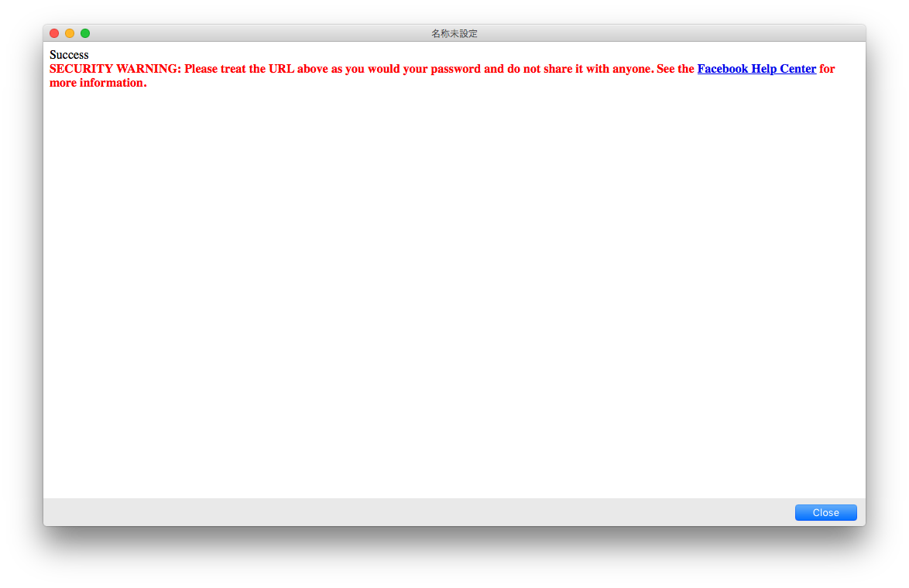
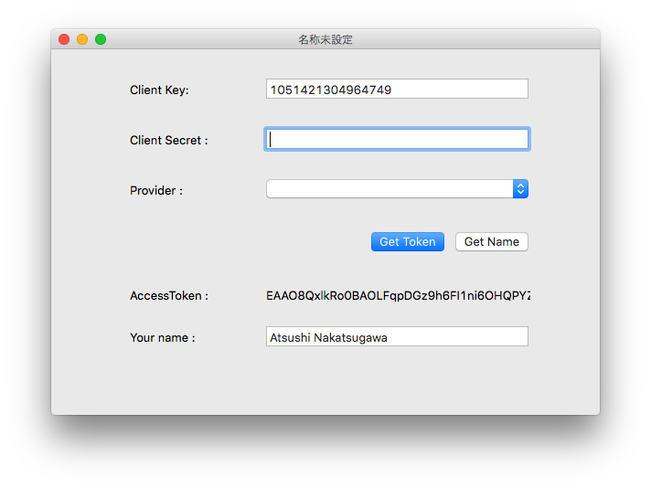

# Facebook OAuth

Facebook OAuth and get user information demo using Xojo.

## Usage

```
# Set client key and client secret.
Dim provider as string = pmProvider.Text
Dim clientKey as String = txtClientKey.Text
Dim clientSecret as String = txtClientSecret.Text

# Create instance. Currently we don't use provider parameter.
App.oauth2 = new OAuth2(provider, clientKey, clientSecret)

# Get OAuth url. You should open this url using popup window.  
Dim url as string =  App.oauth2.getOAuthUrl
popupBrowser.htmlView.LoadURL url

popupBrowser.ShowModal
```

## Screenshots of sample application

### Main window

You can use default client key. I don't use any information of yours.



### Pop up window

You should log in to facebook and accept connect.



When it done, alert will show on screen.



We use an URL of Facebook *https://www.facebook.com/connect/login_success.html*. This URL provides to Chrome app or any devices such as TV, Desktop application.



### Back to main window

You can see an access token.


As you click "Get Name" button, you will get the your name on Facebook.



## TODO

- [ ] Support other OAuth2 provider
	- [ ] GitHub
	- [ ] Buffer
	- [ ] Instagram
- [ ] Support more functions.
	- [ ] Get timeline
	- [ ] Upload photo
	- [ ] Post update

## LICENSE

MIT LICENSE.

